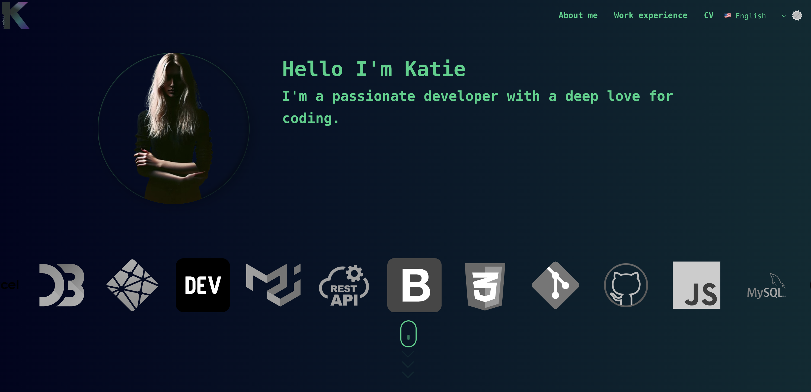
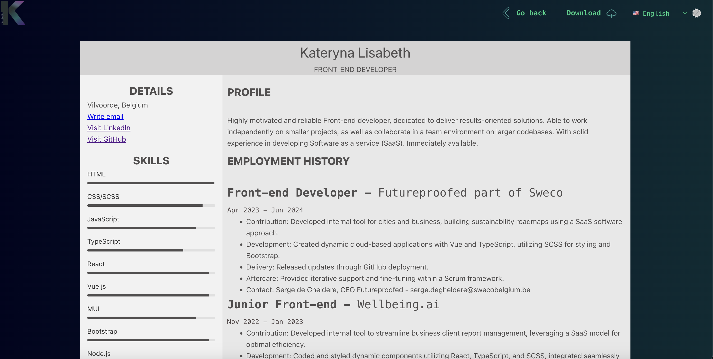

# Personal Portfolio Website

This is my personal portfolio website, built using **Vue.js** and **TypeScript**. It showcases my work, skills, and includes an option to view and download my CV.

The website also supports multiple languages, with translations in both **English** and **Dutch (Nederlands)** using **vue-i18n**.



## Features

- **Projects Showcase**: Highlighting my completed projects and professional journey.
- **Responsive Design**: The website is fully responsive and works across different screen sizes and devices.
- **CV Download**: Viewers can easily view and download my CV directly from the website.
- **Language Support**: The website can be viewed in **English** and **Dutch (Nederlands)** using the integrated **vue-i18n** library.



## Technologies Used

- **Vue.js**: Frontend framework for building the user interface.
- **TypeScript**: Strongly typed programming language for scalable and maintainable code.
- **vue-i18n**: For handling translations between English and Dutch.
- **HTML5** and **CSS3**: For the structure and styling of the website.

## How to Run Locally

To run the website on your local machine:

1. Clone the repository:
   ```bash
   git clone https://github.com/yourusername/your-portfolio-repo.git
